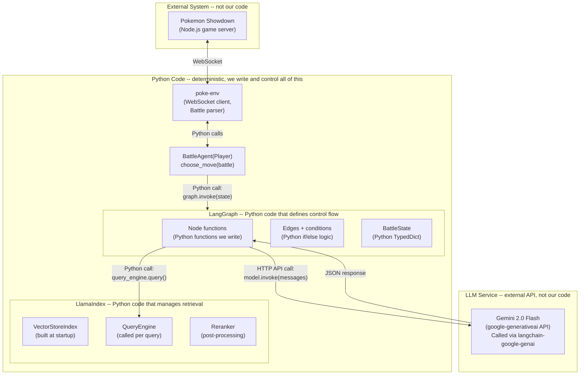
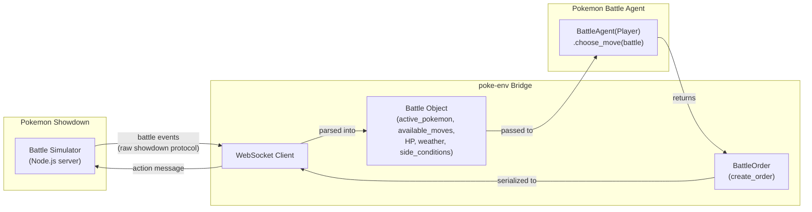
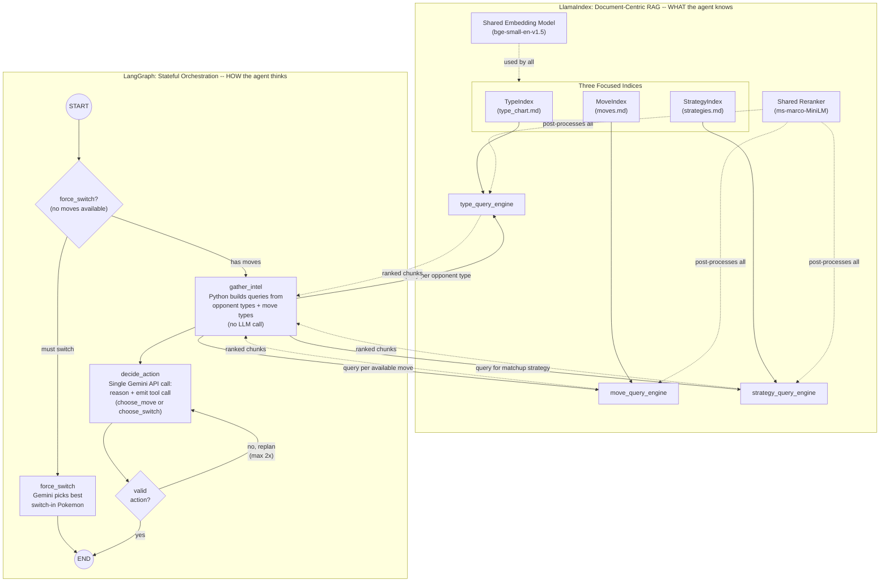
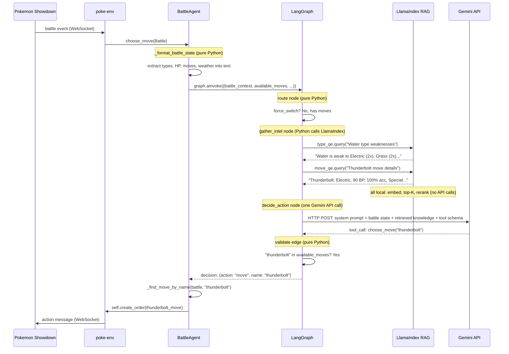
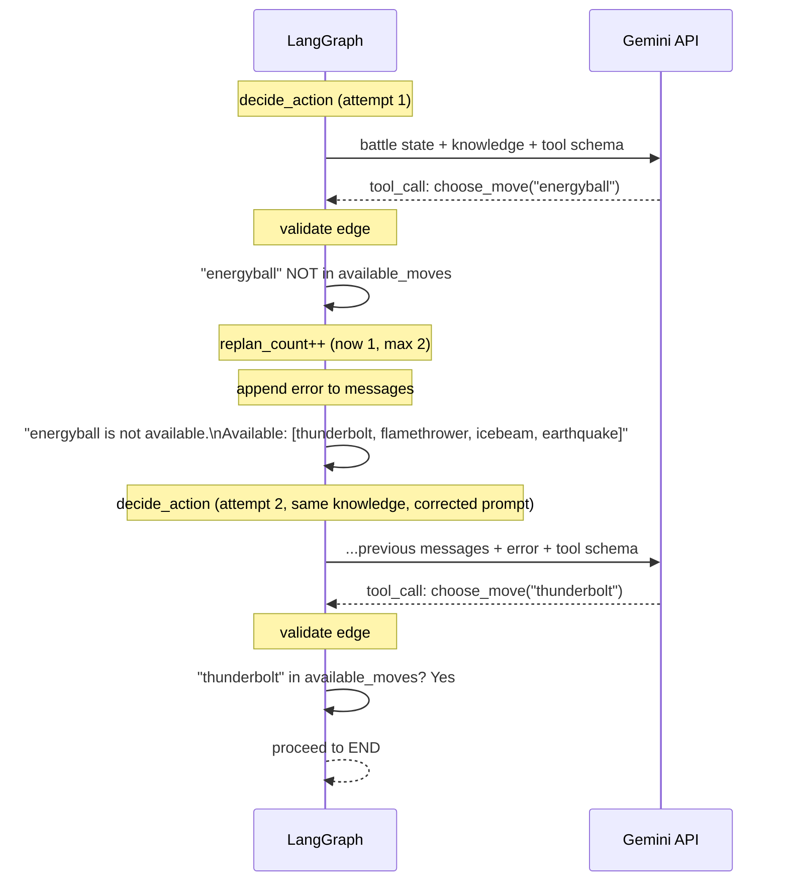
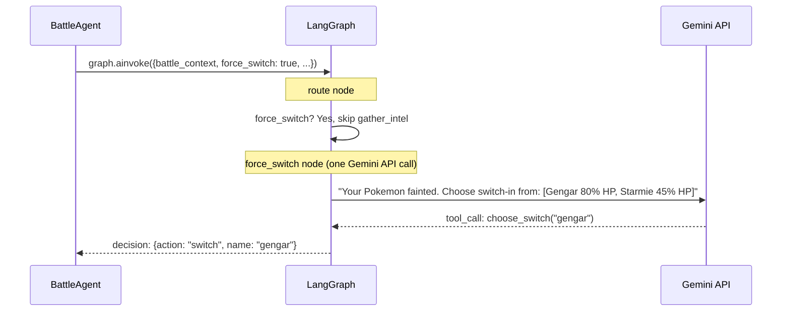

# Pokemon Battle Agent: Graph Control vs Retrieval Workflow Abstraction

**Central thesis:** An AI agent needs two kinds of machinery -- *control flow* (what to do, in what order, with what fallbacks) and *knowledge retrieval* (what facts to look up and how to rank them). These are fundamentally different problems. This project makes the boundary visible by using **LangGraph** for graph control and **LlamaIndex** for retrieval workflow abstraction, then showing exactly where one ends and the other begins.

**Key insight: LangGraph is irreplaceable; LlamaIndex is interchangeable.** You cannot remove the graph control layer without losing cycles, conditional branching, and stateful replanning -- there is no simpler substitute. But the retrieval layer (LlamaIndex) could be swapped for LangChain's built-in FAISS + embeddings + retriever with identical results for this project. We keep LlamaIndex because it provides a cleaner *dedicated* abstraction for the retrieval problem, making the boundary easier to see and discuss. Where relevant, we annotate the LangChain equivalent so you can see the interchangeability.

---

## Diagram 0: Code vs Agent -- Where Are the Boundaries?

Before the architecture diagrams, this is the most important conceptual diagram. It answers: "What is code? What is the agent? Where does the LLM fit?"



**Key boundaries:**

- **Everything inside "Python Code" is deterministic code we write.** LangGraph is not magic -- it is a Python library that runs our functions in a defined order. LlamaIndex is not magic -- it is a Python library that embeds text and does vector similarity search. We control all of it.
- **The LLM (Gemini) is an external service.** It is called via HTTP API from inside two LangGraph nodes (`plan_strategy` and `select_action`). The LLM never "runs" the agent. Our Python code calls it, receives text/tool-calls back, and decides what to do with the response.
- **Pokemon Showdown is an external service.** poke-env handles the WebSocket connection. Our code never touches the game engine directly.
- **The "agent" is the combination of all Python code.** There is no separate "agent process." The agent is `BattleAgent.choose_move()`, which calls LangGraph, which calls LlamaIndex and Gemini, and returns an order. It is all one synchronous (async) Python call stack.

**How Gemini is called** -- via `langchain-google-genai`, which is a thin wrapper:

```python
from langchain_google_genai import ChatGoogleGenerativeAI

llm = ChatGoogleGenerativeAI(model="gemini-2.0-flash", temperature=0.2)
response = llm.invoke(messages)       # plan_strategy node
response = llm.bind_tools(tools).invoke(messages)  # select_action node
```

This is an HTTP POST to Google's API. The LLM sees a prompt, returns text. Our code parses the response and moves to the next graph node. The LLM has no access to poke-env, no access to the vector index, no ability to "do" anything -- it only returns text that our code interprets.

---

## Diagram 1: Agent and the World

How the agent boundary sits between the player and the battle simulator. poke-env is the middleware that translates WebSocket protocol into Python objects.



Key point: from the agent's perspective, **each turn is a single function call** -- `choose_move(battle) -> BattleOrder`. The outer battle loop (turn sequencing, damage resolution, fainting) is managed entirely by Pokemon Showdown. The agent's job is to make one good decision per call.

---

## Diagram 2: Two Paradigms Inside the Agent (Revised)

This is the core architectural comparison. The left side shows **what the agent knows** (LlamaIndex); the right side shows **how the agent thinks** (LangGraph). They meet at the `gather_intel` node, where the orchestrator queries the knowledge engine.

**Changes from initial design after engineering review:**
- Removed redundant `observe_battle` node (formatting happens in `BattleAgent` before graph invocation)
- Merged `plan_strategy` + `select_action` into single `decide_action` node (one LLM call, not two)
- Replan loop targets `decide_action` directly (knowledge doesn't change on replan)
- Added `force_switch` fast path (skip retrieval when a Pokemon faints)
- Split into three separate indices (one per data file) so each query engine is focused



**What this diagram shows:**

- **LlamaIndex** is a pure data pipeline -- it never decides anything. Documents flow in at index time; queries flow in at retrieval time; ranked chunks flow out. Three separate indices (one per domain) ensure each query hits a focused corpus. It demonstrates: semantic search over structured game data, embedding-based similarity, and cross-encoder reranking to sharpen results.
- **LangGraph** is a pure control-flow graph -- it has no built-in knowledge. It demonstrates: typed shared state (`BattleState`), conditional entry point (`force_switch` fast path), a single LLM call per turn, and a **replan cycle** that retries the LLM decision without re-retrieving unchanged knowledge.
- **The LLM (Gemini) is called at exactly one node** -- `decide_action` (or `force_switch` for the switch-only path). One HTTP API call per turn in the happy path; up to three on replan.
- **The integration point** is the `gather_intel` node. Deterministic Python code extracts opponent types and move types from the battle state, constructs targeted queries, and calls the appropriate LlamaIndex query engine. No LLM is needed to decide what to retrieve.

---

## Diagram 3: Per-Turn Sequence (Revised -- single `choose_move` call)

How data flows through both systems during one turn of battle. This makes the code-vs-API boundaries explicit.

**Happy path** (has moves available):



**Replan path** (LLM picks invalid move):



**Force-switch path** (Pokemon fainted, no moves available):



---

## Diagram 4: The Full Call Stack (Revised)

The actual Python call stack for one turn. Every line is annotated with what kind of code it is.

```
Pokemon Showdown sends WebSocket message
  -> poke-env parses it into Battle object
    -> BattleAgent.choose_move(battle)                     # our code (async)
      -> self._format_battle_state(battle)                 # our code (pure Python)
      -> is force_switch? (battle.available_moves == [])   # our code (pure Python)
      -> self.graph.ainvoke({                              # our code calls LangGraph
            "battle_context": formatted_state,
            "available_moves": [...],
            "available_switches": [...],
            "force_switch": bool,
            "replan_count": 0
         }, config={"configurable": {"thread_id": battle.battle_tag}})
        |
        |-- [if has moves] --------------------------------
        |   -> gather_intel(state)                         # our code (pure Python)
        |     -> _build_queries(state)                     # our code: extract types, build query strings
        |     -> type_query_engine.query("Water weakness") # LlamaIndex (local, no API)
        |     -> move_query_engine.query("Thunderbolt")    # LlamaIndex (local, no API)
        |     <- returns combined knowledge_context
        |   -> decide_action(state)                        # our code
        |     -> llm.bind_tools(tools).ainvoke(messages)   # HTTP API call to Gemini (THE ONLY API CALL)
        |     <- returns AIMessage with tool_call
        |     -> _parse_tool_call(response)                # our code (pure Python)
        |   -> validate_action(state)                      # our code (pure Python)
        |     -> move_name in available_moves?
        |     |-- yes -> END
        |     |-- no  -> append error, replan_count++, loop to decide_action (max 2x)
        |
        |-- [if force_switch] -----------------------------
        |   -> force_switch_node(state)                    # our code
        |     -> llm.bind_tools(switch_tool).ainvoke(...)  # HTTP API call to Gemini
        |     <- returns switch choice
        |   -> END
        |
      <- returns {"decision": {"action": "move"|"switch", "name": "..."}}
      -> self._resolve_decision(battle, decision)          # our code (pure Python)
      -> self.create_order(move_or_pokemon)                # poke-env helper
    <- returns BattleOrder
  -> poke-env sends WebSocket message
Pokemon Showdown resolves the turn
```

**External calls per turn**: exactly 1 Gemini API call in the happy path (up to 3 on double replan). Zero API calls for LlamaIndex (all local). The only network dependency beyond Pokemon Showdown is Google's Gemini API.

---

## Paradigm Comparison: Graph Control vs Retrieval Workflow Abstraction

### When do you need graph control? (LangGraph)

Use a graph orchestrator when your problem has:

- **Cycles**: the agent might need to retry. In our case, if the LLM picks an unavailable move, the conditional edge loops back to `gather_intel` -- the graph re-enters a previous node with updated state. You cannot express this with a linear chain or a single LLM call.
- **Conditional branching**: the next step depends on the current state. After `select_action`, the route depends on whether the action is valid. After a Pokemon faints, the agent must switch instead of attacking. These are `if/else` decisions on mutable state.
- **Cross-step memory**: the `BattleState` accumulates context across nodes within a turn *and* across turns via the checkpointer. The `plan_strategy` node sees knowledge retrieved by `gather_intel` because they share state. Turn N sees what happened in turn N-1 because the checkpointer persists state.
- **Multi-step sequencing with dependencies**: observe *then* retrieve *then* reason *then* act -- each node depends on the previous node's output. The graph enforces this order.

**Could you do this without LangGraph?** Only by writing the equivalent logic manually: a while-loop with a state dict, if/else branching, and manual error handling. LangGraph makes this declarative (define nodes and edges) rather than imperative (write the loop yourself). For complex graphs, the declarative approach is less error-prone and easier to visualize.

### When do you need a retrieval workflow abstraction? (LlamaIndex or equivalent)

Use a retrieval framework when your problem has:

- **Unstructured knowledge**: the 18x18 type chart, hundreds of move descriptions, strategy guides -- too large to fit in an LLM prompt, but semantically queryable.
- **Precision requirements**: a naive search for "Fire vs Water" might return irrelevant chunks. Reranking (cross-encoder) ensures the top results are actually about Fire attacking Water, not Water attacking Fire.
- **Index-once, query-many**: the knowledge base is built at startup and queried dozens of times per battle. The retrieval framework handles persistence, embedding caching, and efficient similarity search.

**Could you do this without LlamaIndex?** Yes. LangChain provides equivalent components:

| LlamaIndex | LangChain equivalent |
|---|---|
| `SimpleDirectoryReader` | `DirectoryLoader` + `TextLoader` |
| `VectorStoreIndex` | `FAISS.from_documents()` |
| `HuggingFaceEmbedding` | `HuggingFaceEmbeddings` |
| `index.as_query_engine()` | `vectorstore.as_retriever()` |
| `SentenceTransformerRerank` | `CrossEncoderReranker` (community) |

For our markdown-file Pokedex, the output would be identical. LlamaIndex adds value over LangChain's built-in tools when your data is complex (PDFs with tables via LlamaParse, knowledge graph indices, recursive retrieval, multi-index query decomposition). For simple documents, it is a matter of abstraction preference.

### The irreplaceability test

- **Remove LangGraph**: you lose the replan cycle, the conditional branching, the cross-turn checkpointer, and the declarative graph structure. You must rewrite all of this as manual Python control flow. The agent's logic becomes harder to reason about and modify.
- **Remove LlamaIndex**: you swap in LangChain's FAISS retriever. The `gather_intel` node calls `retriever.invoke(query)` instead of `query_engine.query(query)`. Everything else stays the same. No architectural change.

This asymmetry is the core lesson: **graph control is a structural choice that shapes your entire agent architecture; retrieval is a pluggable capability that any framework can provide.**

---

## Project Structure

```
pokemon-battle-agent/
├── PLAN.md                        # this file
├── requirements.txt
├── .env.example
├── data/
│   ├── type_chart.md              # 18x18 type effectiveness matrix
│   ├── moves.md                   # ~100 competitive moves with stats
│   └── strategies.md              # Battle concepts and heuristics
├── src/
│   ├── __init__.py
│   ├── knowledge/
│   │   ├── __init__.py
│   │   ├── indexer.py             # PokemonKnowledgeBase: VectorStoreIndex + embeddings + reranker
│   │   └── tools.py               # build_knowledge_tools: query engines as plain callables
│   ├── graph/
│   │   ├── __init__.py
│   │   ├── state.py               # BattleState TypedDict
│   │   ├── nodes.py               # gather_intel, decide_action, force_switch, validate, routers
│   │   └── graph.py               # build_battle_graph: StateGraph assembly
│   └── agent.py                   # BattleAgent(Player) -- poke-env + LangGraph bridge
├── config.py                      # Env vars, server config
└── main.py                        # CLI: local dev vs remote competition
```

---

## Class and Module Specifications

### `PokemonKnowledgeBase` -- `src/knowledge/indexer.py`

*Responsibility: build and manage three focused vector indices from markdown files.*

```python
class PokemonKnowledgeBase:
    # --- Construction ---
    def __init__(self, data_dir: str = "data/", storage_dir: str = "storage/")
    # Checks if storage_dir has persisted indices; if yes, loads them.
    # If no, calls _build_indices(). Either way, creates query engines.

    # --- Index Lifecycle (called once at startup) ---
    def _build_indices(self) -> None
    # For each markdown file in data_dir:
    #   1. Load with SimpleDirectoryReader (single file mode)
    #   2. Chunk with SentenceSplitter (chunk_size=256, overlap=32)
    #   3. Embed with HuggingFaceEmbedding("BAAI/bge-small-en-v1.5")
    #   4. Build VectorStoreIndex
    #   5. Persist to storage_dir/<index_name>/
    # Result: self._type_index, self._move_index, self._strategy_index

    def _load_indices(self) -> None
    # Load persisted indices from storage_dir. Skip _build_indices.

    def _create_query_engines(self) -> None
    # For each index, create a query_engine with:
    #   similarity_top_k=8
    #   node_postprocessors=[SentenceTransformerRerank(top_n=3)]
    # Result: self.type_engine, self.move_engine, self.strategy_engine

    # --- Public Query Interface ---
    def query_type(self, question: str) -> str
    # Calls self.type_engine.query(question), returns response text

    def query_move(self, question: str) -> str
    # Calls self.move_engine.query(question), returns response text

    def query_strategy(self, question: str) -> str
    # Calls self.strategy_engine.query(question), returns response text
```

*LangChain equivalent: replace `VectorStoreIndex` with `FAISS.from_documents()`, `HuggingFaceEmbedding` with `HuggingFaceEmbeddings`, `query_engine.query()` with `retriever.invoke()`. Same input/output contract.*

### `build_knowledge_tools` -- `src/knowledge/tools.py`

*Responsibility: wrap `PokemonKnowledgeBase` methods as callable dict for use in LangGraph nodes.*

```python
def build_knowledge_tools(kb: PokemonKnowledgeBase) -> dict[str, Callable]:
    # Returns a dict with three callables:
    #   "query_type": kb.query_type
    #   "query_move": kb.query_move
    #   "query_strategy": kb.query_strategy
    # These are plain Python callables, NOT LangChain Tool objects.
    # The gather_intel node calls them directly -- they do not go through
    # LangGraph's ToolNode, because the graph (not the LLM) decides when to retrieve.
```

Design note: these are **not** LLM-invokable tools. The LLM never decides "I should look up type info." The `gather_intel` node, which is deterministic Python code, decides what to query based on the battle state. This keeps retrieval predictable and avoids wasting an LLM call on query planning.

### `BattleState` -- `src/graph/state.py`

*Responsibility: typed shared state for the LangGraph decision graph.*

```python
class BattleState(TypedDict):
    # --- Inputs (set by BattleAgent before graph invocation) ---
    battle_context: str                # formatted battle state text
    available_moves: list[str]         # move IDs currently available (for validation)
    available_switches: list[str]      # pokemon species available to switch to
    force_switch: bool                 # True when a Pokemon fainted, no moves available

    # --- Accumulated by nodes ---
    messages: Annotated[list[BaseMessage], add_messages]  # LLM conversation (append-only)
    knowledge_context: str             # retrieved text from LlamaIndex (overwritten per turn)

    # --- Output ---
    decision: Optional[dict]           # {"action": "move"|"switch", "name": "..."} or None

    # --- Control flow ---
    replan_count: int                  # incremented on invalid action, max 2
```

Message windowing: the `messages` field uses `add_messages` reducer but is trimmed by `BattleAgent` before each graph invocation to keep only the last 3 turns of history (approximately 6-10 messages). This prevents unbounded growth over a long battle.

### Node Functions -- `src/graph/nodes.py`

*Responsibility: the four node functions that the graph executes. Each receives `BattleState`, returns a partial state update dict.*

Node functions need access to the LLM and knowledge tools. We use **closure factories** to inject dependencies:

```python
def make_gather_intel(kb_tools: dict[str, Callable]):
    """Returns a gather_intel node function with knowledge tools bound."""

    def gather_intel(state: BattleState) -> dict:
        # 1. Parse opponent types from battle_context (regex or structured parsing)
        # 2. Parse available move types from battle_context
        # 3. Build targeted queries:
        #      - type_query: "{opponent_type} type weaknesses and resistances"
        #      - move_queries: one per available move (e.g., "Thunderbolt move details")
        #      - strategy_query: "{my_type} vs {opponent_type} matchup strategy"
        # 4. Call kb_tools["query_type"], kb_tools["query_move"], kb_tools["query_strategy"]
        # 5. Concatenate results into knowledge_context
        # Return: {"knowledge_context": combined_text}
    return gather_intel


def make_decide_action(llm: ChatGoogleGenerativeAI):
    """Returns a decide_action node function with LLM bound."""

    tools = [choose_move_tool, choose_switch_tool]  # LangChain tool schemas
    llm_with_tools = llm.bind_tools(tools)

    def decide_action(state: BattleState) -> dict:
        # 1. Build system message with battle strategy heuristics
        # 2. Build user message: battle_context + knowledge_context + available moves/switches
        # 3. Append to state["messages"]
        # 4. Call llm_with_tools.ainvoke(messages)
        # 5. Parse tool_call from AIMessage -> {"action": ..., "name": ...}
        # 6. If no valid tool_call parsed, set decision=None (will trigger replan)
        # Return: {"decision": parsed_or_none, "messages": [ai_response]}
    return decide_action


def make_force_switch(llm: ChatGoogleGenerativeAI):
    """Returns a force_switch node for when a Pokemon faints."""

    tools = [choose_switch_tool]
    llm_with_tools = llm.bind_tools(tools)

    def force_switch(state: BattleState) -> dict:
        # 1. Build prompt: "Your Pokemon fainted. Choose from: {available_switches}"
        # 2. Call llm_with_tools.ainvoke(messages)
        # 3. Parse tool_call -> {"action": "switch", "name": ...}
        # Return: {"decision": parsed_switch}
    return force_switch


def validate_action(state: BattleState) -> dict:
    """Pure Python validation. No LLM call."""
    # If decision is None -> replan
    # If decision.action == "move" and decision.name not in available_moves -> replan
    # If decision.action == "switch" and decision.name not in available_switches -> replan
    # If replan_count >= 2 -> give up (decision stays None, agent will use fallback)
    # On replan: append HumanMessage with error details to messages
    # Return: {"replan_count": new_count, "messages": [error_msg] if replan}
```

### Router Functions -- `src/graph/nodes.py`

```python
def route_entry(state: BattleState) -> str:
    """Conditional edge after START: 'gather_intel' or 'force_switch'."""
    if state["force_switch"]:
        return "force_switch"
    return "gather_intel"


def route_after_validate(state: BattleState) -> str:
    """Conditional edge after validate: 'end' or 'decide_action'."""
    if state["decision"] is not None:
        return "end"
    if state["replan_count"] >= 2:
        return "end"  # give up, agent uses fallback
    return "decide_action"
```

### `build_battle_graph` -- `src/graph/graph.py`

*Responsibility: assemble the StateGraph with all nodes and edges, return compiled graph.*

```python
def build_battle_graph(
    llm: ChatGoogleGenerativeAI,
    kb_tools: dict[str, Callable],
) -> CompiledStateGraph:
    # 1. Create node functions via closures
    gather_intel = make_gather_intel(kb_tools)
    decide_action = make_decide_action(llm)
    force_switch_node = make_force_switch(llm)

    # 2. Build StateGraph
    builder = StateGraph(BattleState)
    builder.add_node("gather_intel", gather_intel)
    builder.add_node("decide_action", decide_action)
    builder.add_node("force_switch", force_switch_node)
    builder.add_node("validate", validate_action)

    # 3. Wire edges
    builder.add_conditional_edges(START, route_entry, {
        "gather_intel": "gather_intel",
        "force_switch": "force_switch",
    })
    builder.add_edge("gather_intel", "decide_action")
    builder.add_edge("decide_action", "validate")
    builder.add_edge("force_switch", END)
    builder.add_conditional_edges("validate", route_after_validate, {
        "end": END,
        "decide_action": "decide_action",
    })

    # 4. Compile with checkpointer
    return builder.compile(checkpointer=InMemorySaver())
```

### `BattleAgent` -- `src/agent.py`

*Responsibility: bridge poke-env's Player interface to the LangGraph decision graph.*

```python
class BattleAgent(Player):
    # --- Construction ---
    def __init__(self, llm, knowledge_base, *args, **kwargs)
    # 1. super().__init__(*args, **kwargs)  -- poke-env Player init
    # 2. self.kb = knowledge_base           -- PokemonKnowledgeBase instance
    # 3. self.graph = build_battle_graph(llm, build_knowledge_tools(self.kb))
    # 4. self.turn_history: dict[str, list] = {}  -- per-battle message history

    # --- Main Entry Point (called by poke-env each turn) ---
    async def choose_move(self, battle: Battle) -> BattleOrder
    # 1. Format battle state: _format_battle_state(battle)
    # 2. Get trimmed message history (last 3 turns) for this battle
    # 3. Build initial BattleState dict
    # 4. try: result = await self.graph.ainvoke(state, config)
    # 5. Extract decision from result
    # 6. _resolve_decision(battle, decision) -> BattleOrder
    # 7. except: self.choose_random_move(battle)

    # --- Battle State Formatting ---
    def _format_battle_state(self, battle: Battle) -> str
    # Converts Battle object to structured text string.
    # Includes: active pokemon (species, types, HP%, status, boosts),
    #           opponent active (species, types, HP%, status, boosts),
    #           available moves (id, type, base_power, accuracy, PP, category),
    #           available switches (species, HP%, status),
    #           weather, terrain, side conditions.

    def _extract_available_moves(self, battle: Battle) -> list[str]
    # Returns list of move IDs: [move.id for move in battle.available_moves]

    def _extract_available_switches(self, battle: Battle) -> list[str]
    # Returns list of species names: [normalize_name(p.species) for p in battle.available_switches]

    # --- Decision Resolution ---
    def _resolve_decision(self, battle: Battle, decision: dict | None) -> BattleOrder
    # If decision is None -> self.choose_random_move(battle)
    # If decision.action == "move":
    #     move = _find_move_by_name(battle, decision.name)
    #     if move: return self.create_order(move)
    #     else: return self.choose_random_move(battle)
    # If decision.action == "switch":
    #     pokemon = _find_pokemon_by_name(battle, decision.name)
    #     if pokemon: return self.create_order(pokemon)
    #     else: return self.choose_random_move(battle)

    def _find_move_by_name(self, battle: Battle, move_name: str) -> Move | None
    # Exact match on move.id, fallback to move.name case-insensitive

    def _find_pokemon_by_name(self, battle: Battle, pokemon_name: str) -> Pokemon | None
    # Exact match on normalized species name

    # --- Message History Management ---
    def _get_trimmed_history(self, battle_tag: str) -> list[BaseMessage]
    # Returns last 3 turns of messages for this battle (approx 6-10 messages)
    # Prevents unbounded message growth over long battles

    def _save_turn_history(self, battle_tag: str, messages: list[BaseMessage]) -> None
    # Appends this turn's messages to the per-battle history
```

### `config.py`

```python
# Reads from .env:
#   GOOGLE_API_KEY       -- required, for Gemini API
#   BATTLE_FORMAT        -- default "gen9randombattle"
#   LOCAL_SERVER_URL     -- default "localhost:8000"
#   REMOTE_SERVER_URL    -- for course HuggingFace server
#   REMOTE_USERNAME      -- account for remote server
#   REMOTE_PASSWORD      -- password for remote server
```

### `main.py`

```python
# CLI entry point:
#   python main.py --mode local    # battle RandomPlayer on localhost
#   python main.py --mode remote   # connect to course server
#   python main.py --n-battles 5   # number of battles to play
#
# 1. Load config from .env
# 2. Build PokemonKnowledgeBase (builds/loads indices)
# 3. Create ChatGoogleGenerativeAI(model="gemini-2.0-flash", temperature=0.2)
# 4. Create BattleAgent(llm, knowledge_base, battle_format=..., server_configuration=...)
# 5. If local: create RandomPlayer, await agent.battle_against(opponent, n_battles=N)
# 6. If remote: configure remote server, await agent.ladder(n_battles=N) or accept_challenges
# 7. Print win/loss stats
```

### Key Dependencies

- `poke-env` -- battle simulator interface
- `langgraph`, `langchain-core`, `langchain-google-genai` -- graph orchestration + Gemini
- `llama-index-core`, `llama-index-embeddings-huggingface` -- RAG pipeline
- `sentence-transformers` -- cross-encoder reranking
- `python-dotenv` -- config management
